# [📈 Live Status](https://status.projetignis.fr): <!--live status--> **🟩 All systems operational**

This repository contains the open-source uptime monitor and status page for [Ignis](https://www.projetignis.fr), powered by [Upptime](https://github.com/upptime/upptime).

With [Upptime](https://upptime.js.org), you can get your own unlimited and free uptime monitor and status page, powered entirely by a GitHub repository. We use [Issues](https://github.com/projetignis/uptime/issues) as incident reports, [Actions](https://github.com/projetignis/uptime/actions) as uptime monitors, and [Pages](https://status.projetignis.fr) for the status page.

<!--start: status pages-->
<!-- This summary is generated by Upptime (https://github.com/upptime/upptime) -->
<!-- Do not edit this manually, your changes will be overwritten -->
<!-- prettier-ignore -->
| URL | Status | History | Response Time | Uptime |
| --- | ------ | ------- | ------------- | ------ |
|  [Alfa](https://alfa.projetignis.fr) | 🟩 Up | [alfa.yml](https://github.com/projetignis/status/commits/HEAD/history/alfa.yml) | 

 440ms
     
 | 

<a href="https://status.projetignis.fr/history/alfa">100.00%</a>
    

|  [Bravo](https://bravo.projetignis.fr) | 🟩 Up | [bravo.yml](https://github.com/projetignis/status/commits/HEAD/history/bravo.yml) | 

 379ms
     
 | 

<a href="https://status.projetignis.fr/history/bravo">100.00%</a>
    

|  [Charlie](https://charlie.projetignis.fr) | 🟩 Up | [charlie.yml](https://github.com/projetignis/status/commits/HEAD/history/charlie.yml) | 

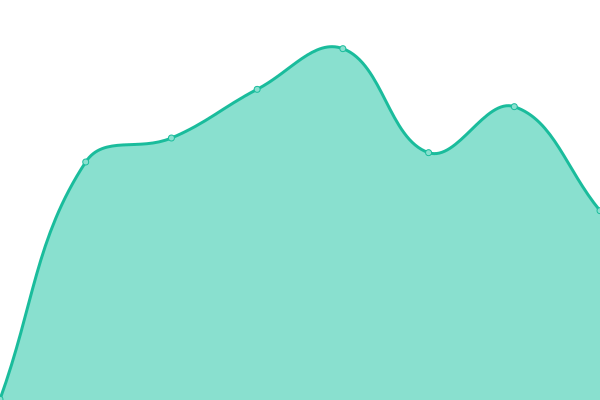 386ms
     
 | 

<a href="https://status.projetignis.fr/history/charlie">100.00%</a>
    

|  [Home](https://www.projetignis.fr) | 🟩 Up | [home.yml](https://github.com/projetignis/status/commits/HEAD/history/home.yml) | 

 108ms
     
 | 

<a href="https://status.projetignis.fr/history/home">100.00%</a>
    

|  [Status](https://status.projetignis.fr) | 🟩 Up | [status.yml](https://github.com/projetignis/status/commits/HEAD/history/status.yml) | 

 114ms
     
 | 

<a href="https://status.projetignis.fr/history/status">91.85%</a>
    

|  [Mail](https://mail.projetignis.fr) | 🟩 Up | [mail.yml](https://github.com/projetignis/status/commits/HEAD/history/mail.yml) | 

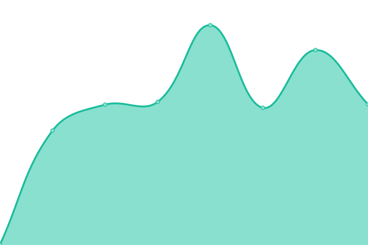 368ms
     
 | 

<a href="https://status.projetignis.fr/history/mail">100.00%</a>
    

|  [Vault](https://vault.projetignis.fr) | 🟩 Up | [vault.yml](https://github.com/projetignis/status/commits/HEAD/history/vault.yml) | 

 739ms
     
 | 

<a href="https://status.projetignis.fr/history/vault">99.11%</a>
    

|  [Git](https://git.projetignis.fr) | 🟩 Up | [git.yml](https://github.com/projetignis/status/commits/HEAD/history/git.yml) | 

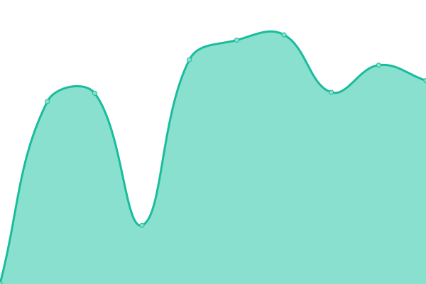 808ms
     
 | 

<a href="https://status.projetignis.fr/history/git">95.71%</a>
    

|  [Git (SSH)](projetignis.fr) | 🟩 Up | [git-ssh.yml](https://github.com/projetignis/status/commits/HEAD/history/git-ssh.yml) | 

 111ms
     
 | 

<a href="https://status.projetignis.fr/history/git-ssh">100.00%</a>
    

|  [Registry](https://registry.projetignis.fr) | 🟩 Up | [registry.yml](https://github.com/projetignis/status/commits/HEAD/history/registry.yml) | 

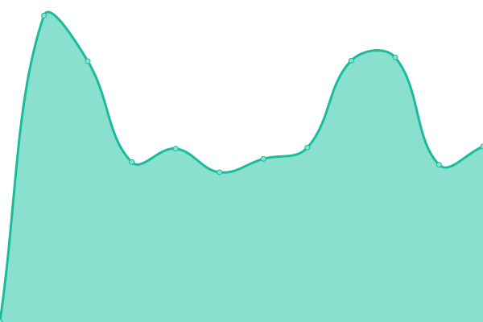 778ms
     
 | 

<a href="https://status.projetignis.fr/history/registry">97.31%</a>
    

|  [S3](https://s3.projetignis.fr) | 🟩 Up | [s3.yml](https://github.com/projetignis/status/commits/HEAD/history/s3.yml) | 

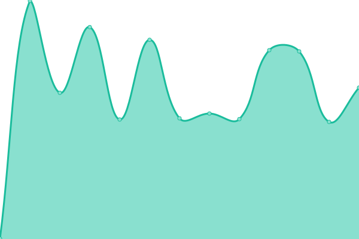 363ms
     
 | 

<a href="https://status.projetignis.fr/history/s3">100.00%</a>
    

|  [CDN](https://cdn.projetignis.fr) | 🟩 Up | [cdn.yml](https://github.com/projetignis/status/commits/HEAD/history/cdn.yml) | 

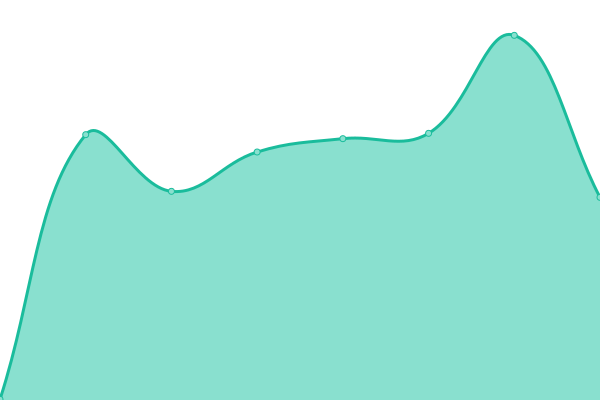 348ms
     
 | 

<a href="https://status.projetignis.fr/history/cdn">100.00%</a>
    

|  [API](https://api.projetignis.fr) | 🟩 Up | [api.yml](https://github.com/projetignis/status/commits/HEAD/history/api.yml) | 

 323ms
     
 | 

<a href="https://status.projetignis.fr/history/api">100.00%</a>
    

|  [Cloud](https://cloud.projetignis.fr) | 🟩 Up | [cloud.yml](https://github.com/projetignis/status/commits/HEAD/history/cloud.yml) | 

 609ms
     
 | 

<a href="https://status.projetignis.fr/history/cloud">100.00%</a>
    

|  [Chat](https://chat.projetignis.fr) | 🟩 Up | [chat.yml](https://github.com/projetignis/status/commits/HEAD/history/chat.yml) | 

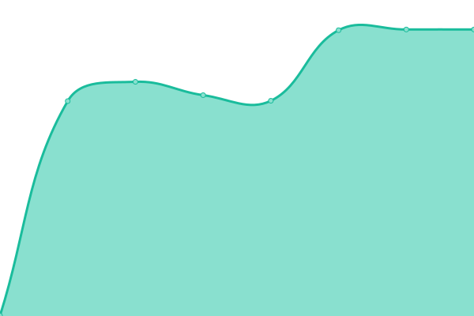 333ms
     
 | 

<a href="https://status.projetignis.fr/history/chat">100.00%</a>
    

|  [Hydra](https://hydra.projetignis.fr) | 🟩 Up | [hydra.yml](https://github.com/projetignis/status/commits/HEAD/history/hydra.yml) | 

 429ms
     
 | 

<a href="https://status.projetignis.fr/history/hydra">100.00%</a>
    

|  [Kratos](https://kratos.projetignis.fr) | 🟩 Up | [kratos.yml](https://github.com/projetignis/status/commits/HEAD/history/kratos.yml) | 

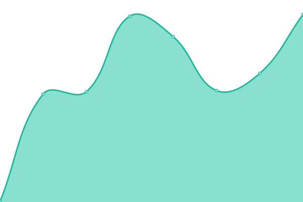 436ms
     
 | 

<a href="https://status.projetignis.fr/history/kratos">100.00%</a>
    

|  [SSO](https://id.projetignis.fr) | 🟩 Up | [sso.yml](https://github.com/projetignis/status/commits/HEAD/history/sso.yml) | 

 374ms
     
 | 

<a href="https://status.projetignis.fr/history/sso">99.73%</a>
    

|  [Pages](https://projetignis.page) | 🟩 Up | [pages.yml](https://github.com/projetignis/status/commits/HEAD/history/pages.yml) | 

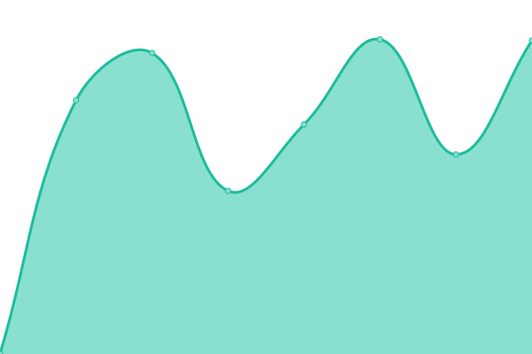 1443ms
     
 | 

<a href="https://status.projetignis.fr/history/pages">100.00%</a>
    

|  [SMTP (25)](mail.projetignis.fr) | 🟩 Up | [smtp-25.yml](https://github.com/projetignis/status/commits/HEAD/history/smtp-25.yml) | 

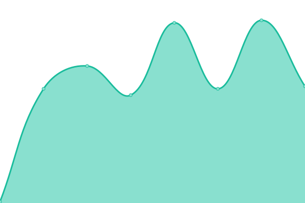 98ms
     
 | 

<a href="https://status.projetignis.fr/history/smtp-25">100.00%</a>
    

|  [ESMTP (465)](mail.projetignis.fr) | 🟩 Up | [esmtp-465.yml](https://github.com/projetignis/status/commits/HEAD/history/esmtp-465.yml) | 

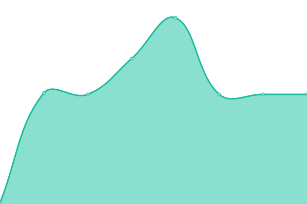 98ms
     
 | 

<a href="https://status.projetignis.fr/history/esmtp-465">100.00%</a>
    

|  [ESMTP (587)](mail.projetignis.fr) | 🟩 Up | [esmtp-587.yml](https://github.com/projetignis/status/commits/HEAD/history/esmtp-587.yml) | 

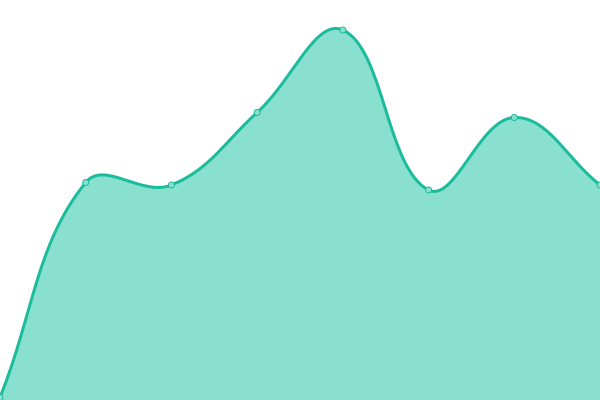 97ms
     
 | 

<a href="https://status.projetignis.fr/history/esmtp-587">100.00%</a>
    

|  [POP3 (110)](mail.projetignis.fr) | 🟩 Up | [pop-3-110.yml](https://github.com/projetignis/status/commits/HEAD/history/pop-3-110.yml) | 

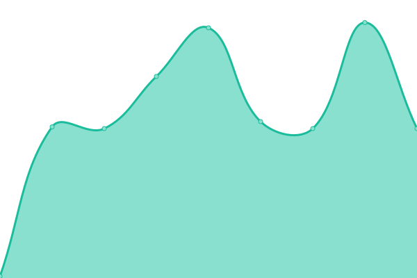 97ms
     
 | 

<a href="https://status.projetignis.fr/history/pop-3-110">100.00%</a>
    

|  [POP3 (995)](mail.projetignis.fr) | 🟩 Up | [pop-3-995.yml](https://github.com/projetignis/status/commits/HEAD/history/pop-3-995.yml) | 

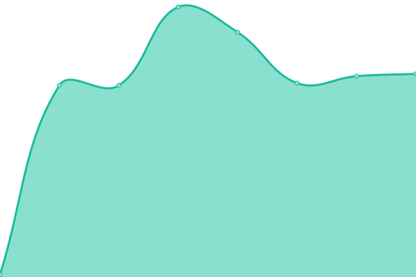 99ms
     
 | 

<a href="https://status.projetignis.fr/history/pop-3-995">100.00%</a>
    

|  [IMAP4 (143)](mail.projetignis.fr) | 🟩 Up | [imap-4-143.yml](https://github.com/projetignis/status/commits/HEAD/history/imap-4-143.yml) | 

 98ms
     
 | 

<a href="https://status.projetignis.fr/history/imap-4-143">100.00%</a>
    

|  [IMAP4 (993)](mail.projetignis.fr) | 🟩 Up | [imap-4-993.yml](https://github.com/projetignis/status/commits/HEAD/history/imap-4-993.yml) | 

 97ms
     
 | 

<a href="https://status.projetignis.fr/history/imap-4-993">100.00%</a>
    

|  [IoT (Broker)](iot.projetignis.net) | 🟩 Up | [io-t-broker.yml](https://github.com/projetignis/status/commits/HEAD/history/io-t-broker.yml) | 

 113ms
     
 | 

<a href="https://status.projetignis.fr/history/io-t-broker">100.00%</a>
    

<!--end: status pages-->

[**Visit our status website →**](https://status.projetignis.fr)

## 📄 License

- Powered by: [Upptime](https://github.com/upptime/upptime)
- Code: [MIT](./LICENSE) © [Ignis](https://www.projetignis.fr)
- Data in the `./history` directory: [Open Database License](https://opendatacommons.org/licenses/odbl/1-0/)
