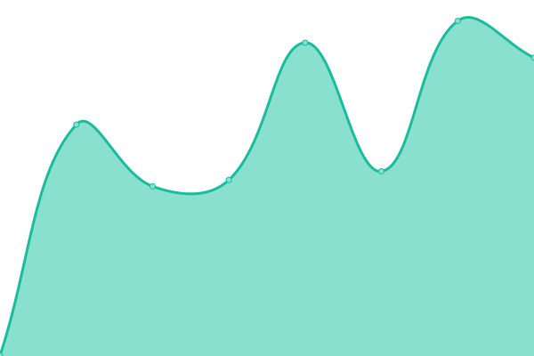

# [📈 Live Status](https://status.projetignis.fr): <!--live status--> **🟩 All systems operational**

This repository contains the open-source uptime monitor and status page for [Ignis](https://www.projetignis.fr), powered by [Upptime](https://github.com/upptime/upptime).

With [Upptime](https://upptime.js.org), you can get your own unlimited and free uptime monitor and status page, powered entirely by a GitHub repository. We use [Issues](https://github.com/projetignis/uptime/issues) as incident reports, [Actions](https://github.com/projetignis/uptime/actions) as uptime monitors, and [Pages](https://status.projetignis.fr) for the status page.

<!--start: status pages-->
<!-- This summary is generated by Upptime (https://github.com/upptime/upptime) -->
<!-- Do not edit this manually, your changes will be overwritten -->
<!-- prettier-ignore -->
| URL | Status | History | Response Time | Uptime |
| --- | ------ | ------- | ------------- | ------ |
|  [Alfa](https://alfa.projetignis.fr) | 🟩 Up | [alfa.yml](https://github.com/projetignis/status/commits/HEAD/history/alfa.yml) | 

 447ms
     
 | 

<a href="https://status.projetignis.fr/history/alfa">100.00%</a>
    

|  [Bravo](https://bravo.projetignis.fr) | 🟩 Up | [bravo.yml](https://github.com/projetignis/status/commits/HEAD/history/bravo.yml) | 

 375ms
     
 | 

<a href="https://status.projetignis.fr/history/bravo">100.00%</a>
    

|  [Charlie](https://charlie.projetignis.fr) | 🟩 Up | [charlie.yml](https://github.com/projetignis/status/commits/HEAD/history/charlie.yml) | 

 361ms
     
 | 

<a href="https://status.projetignis.fr/history/charlie">100.00%</a>
    

|  [Home](https://www.projetignis.fr) | 🟩 Up | [home.yml](https://github.com/projetignis/status/commits/HEAD/history/home.yml) | 

 158ms
     
 | 

<a href="https://status.projetignis.fr/history/home">100.00%</a>
    

|  [Status](https://status.projetignis.fr) | 🟩 Up | [status.yml](https://github.com/projetignis/status/commits/HEAD/history/status.yml) | 

 235ms
     
 | 

<a href="https://status.projetignis.fr/history/status">100.00%</a>
    

|  [Mail](https://mail.projetignis.fr) | 🟩 Up | [mail.yml](https://github.com/projetignis/status/commits/HEAD/history/mail.yml) | 

 356ms
     
 | 

<a href="https://status.projetignis.fr/history/mail">100.00%</a>
    

|  [Vault](https://vault.projetignis.fr) | 🟩 Up | [vault.yml](https://github.com/projetignis/status/commits/HEAD/history/vault.yml) | 

 424ms
     
 | 

<a href="https://status.projetignis.fr/history/vault">100.00%</a>
    

|  [Git](https://git.projetignis.fr) | 🟩 Up | [git.yml](https://github.com/projetignis/status/commits/HEAD/history/git.yml) | 

 1074ms
     
 | 

<a href="https://status.projetignis.fr/history/git">100.00%</a>
    

|  [Git (SSH)](projetignis.fr) | 🟩 Up | [git-ssh.yml](https://github.com/projetignis/status/commits/HEAD/history/git-ssh.yml) | 

 101ms
     
 | 

<a href="https://status.projetignis.fr/history/git-ssh">100.00%</a>
    

|  [Registry](https://registry.projetignis.fr) | 🟩 Up | [registry.yml](https://github.com/projetignis/status/commits/HEAD/history/registry.yml) | 

 384ms
     
 | 

<a href="https://status.projetignis.fr/history/registry">100.00%</a>
    

|  [S3](https://s3.projetignis.fr) | 🟩 Up | [s3.yml](https://github.com/projetignis/status/commits/HEAD/history/s3.yml) | 

 392ms
     
 | 

<a href="https://status.projetignis.fr/history/s3">100.00%</a>
    

|  [CDN](https://cdn.projetignis.fr) | 🟩 Up | [cdn.yml](https://github.com/projetignis/status/commits/HEAD/history/cdn.yml) | 

 408ms
     
 | 

<a href="https://status.projetignis.fr/history/cdn">100.00%</a>
    

|  [API](https://api.projetignis.fr) | 🟩 Up | [api.yml](https://github.com/projetignis/status/commits/HEAD/history/api.yml) | 

 348ms
     
 | 

<a href="https://status.projetignis.fr/history/api">100.00%</a>
    

|  [Cloud](https://cloud.projetignis.fr) | 🟩 Up | [cloud.yml](https://github.com/projetignis/status/commits/HEAD/history/cloud.yml) | 

 679ms
     
 | 

<a href="https://status.projetignis.fr/history/cloud">100.00%</a>
    

|  [Analytics](https://analytics.projetignis.fr) | 🟩 Up | [analytics.yml](https://github.com/projetignis/status/commits/HEAD/history/analytics.yml) | 

 583ms
     
 | 

<a href="https://status.projetignis.fr/history/analytics">100.00%</a>
    

|  [Monitor](https://monitor.projetignis.fr) | 🟩 Up | [monitor.yml](https://github.com/projetignis/status/commits/HEAD/history/monitor.yml) | 

 650ms
     
 | 

<a href="https://status.projetignis.fr/history/monitor">100.00%</a>
    

|  [Chat](https://chat.projetignis.fr) | 🟩 Up | [chat.yml](https://github.com/projetignis/status/commits/HEAD/history/chat.yml) | 

 350ms
     
 | 

<a href="https://status.projetignis.fr/history/chat">100.00%</a>
    

|  [Sentry](https://sentry.projetignis.fr) | 🟩 Up | [sentry.yml](https://github.com/projetignis/status/commits/HEAD/history/sentry.yml) | 

 722ms
     
 | 

<a href="https://status.projetignis.fr/history/sentry">100.00%</a>
    

|  [Pages](https://projetignis.page) | 🟩 Up | [pages.yml](https://github.com/projetignis/status/commits/HEAD/history/pages.yml) | 

 1894ms
     
 | 

<a href="https://status.projetignis.fr/history/pages">100.00%</a>
    

|  [SMTP (25)](mail.projetignis.fr) | 🟩 Up | [smtp-25.yml](https://github.com/projetignis/status/commits/HEAD/history/smtp-25.yml) | 

 87ms
     
 | 

<a href="https://status.projetignis.fr/history/smtp-25">100.00%</a>
    

|  [ESMTP (465)](mail.projetignis.fr) | 🟩 Up | [esmtp-465.yml](https://github.com/projetignis/status/commits/HEAD/history/esmtp-465.yml) | 

 86ms
     
 | 

<a href="https://status.projetignis.fr/history/esmtp-465">100.00%</a>
    

|  [ESMTP (587)](mail.projetignis.fr) | 🟩 Up | [esmtp-587.yml](https://github.com/projetignis/status/commits/HEAD/history/esmtp-587.yml) | 

 86ms
     
 | 

<a href="https://status.projetignis.fr/history/esmtp-587">100.00%</a>
    

|  [POP3 (110)](mail.projetignis.fr) | 🟩 Up | [pop-3-110.yml](https://github.com/projetignis/status/commits/HEAD/history/pop-3-110.yml) | 

 86ms
     
 | 

<a href="https://status.projetignis.fr/history/pop-3-110">100.00%</a>
    

|  [POP3 (995)](mail.projetignis.fr) | 🟩 Up | [pop-3-995.yml](https://github.com/projetignis/status/commits/HEAD/history/pop-3-995.yml) | 

 85ms
     
 | 

<a href="https://status.projetignis.fr/history/pop-3-995">100.00%</a>
    

|  [IMAP4 (143)](mail.projetignis.fr) | 🟩 Up | [imap-4-143.yml](https://github.com/projetignis/status/commits/HEAD/history/imap-4-143.yml) | 

 86ms
     
 | 

<a href="https://status.projetignis.fr/history/imap-4-143">100.00%</a>
    

|  [IMAP4 (993)](mail.projetignis.fr) | 🟩 Up | [imap-4-993.yml](https://github.com/projetignis/status/commits/HEAD/history/imap-4-993.yml) | 

 88ms
     
 | 

<a href="https://status.projetignis.fr/history/imap-4-993">100.00%</a>
    

<!--end: status pages-->

[**Visit our status website →**](https://status.projetignis.fr)

## 📄 License

- Powered by: [Upptime](https://github.com/upptime/upptime)
- Code: [MIT](./LICENSE) © [Ignis](https://www.projetignis.fr)
- Data in the `./history` directory: [Open Database License](https://opendatacommons.org/licenses/odbl/1-0/)
