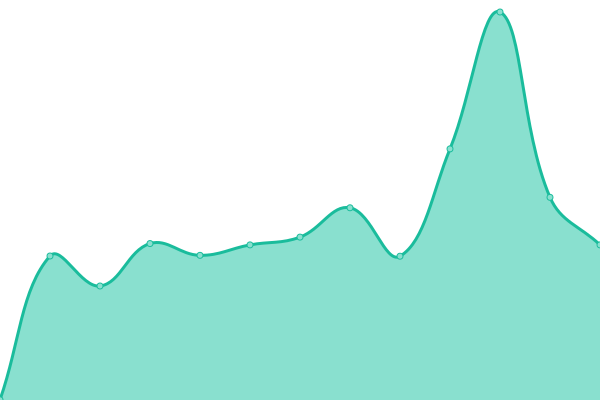

# [📈 Live Status](https://status.projetignis.fr): <!--live status--> **🟩 All systems operational**

This repository contains the open-source uptime monitor and status page for [Ignis](https://www.projetignis.fr), powered by [Upptime](https://github.com/upptime/upptime).

With [Upptime](https://upptime.js.org), you can get your own unlimited and free uptime monitor and status page, powered entirely by a GitHub repository. We use [Issues](https://github.com/projetignis/uptime/issues) as incident reports, [Actions](https://github.com/projetignis/uptime/actions) as uptime monitors, and [Pages](https://status.projetignis.fr) for the status page.

<!--start: status pages-->
<!-- This summary is generated by Upptime (https://github.com/upptime/upptime) -->
<!-- Do not edit this manually, your changes will be overwritten -->
<!-- prettier-ignore -->
| URL | Status | History | Response Time | Uptime |
| --- | ------ | ------- | ------------- | ------ |
|  [Home](https://www.projetignis.fr) | 🟩 Up | [home.yml](https://github.com/projetignis/status/commits/HEAD/history/home.yml) | 

 142ms
     
 | 

<a href="https://status.projetignis.fr/history/home">100.00%</a>
    

|  [Mail](https://mail.projetignis.fr) | 🟩 Up | [mail.yml](https://github.com/projetignis/status/commits/HEAD/history/mail.yml) | 

 385ms
     
 | 

<a href="https://status.projetignis.fr/history/mail">99.64%</a>
    

|  [Vault](https://vault.projetignis.fr) | 🟩 Up | [vault.yml](https://github.com/projetignis/status/commits/HEAD/history/vault.yml) | 

 394ms
     
 | 

<a href="https://status.projetignis.fr/history/vault">99.48%</a>
    

|  [Git](https://git.projetignis.fr) | 🟩 Up | [git.yml](https://github.com/projetignis/status/commits/HEAD/history/git.yml) | 

 1049ms
     
 | 

<a href="https://status.projetignis.fr/history/git">99.49%</a>
    

|  [S3](https://s3.projetignis.fr) | 🟩 Up | [s3.yml](https://github.com/projetignis/status/commits/HEAD/history/s3.yml) | 

 378ms
     
 | 

<a href="https://status.projetignis.fr/history/s3">99.49%</a>
    

|  [Wiki](https://wiki.projetignis.fr) | 🟩 Up | [wiki.yml](https://github.com/projetignis/status/commits/HEAD/history/wiki.yml) | 

 772ms
     
 | 

<a href="https://status.projetignis.fr/history/wiki">99.51%</a>
    

|  [Cloud](https://cloud.projetignis.fr) | 🟩 Up | [cloud.yml](https://github.com/projetignis/status/commits/HEAD/history/cloud.yml) | 

 634ms
     
 | 

<a href="https://status.projetignis.fr/history/cloud">100.00%</a>
    

|  [Analytics](https://analytics.projetignis.fr) | 🟩 Up | [analytics.yml](https://github.com/projetignis/status/commits/HEAD/history/analytics.yml) | 

 565ms
     
 | 

<a href="https://status.projetignis.fr/history/analytics">100.00%</a>
    

<!--end: status pages-->

[**Visit our status website →**](https://status.projetignis.fr)

## 📄 License

- Powered by: [Upptime](https://github.com/upptime/upptime)
- Code: [MIT](./LICENSE) © [Ignis](https://www.projetignis.fr)
- Data in the `./history` directory: [Open Database License](https://opendatacommons.org/licenses/odbl/1-0/)
